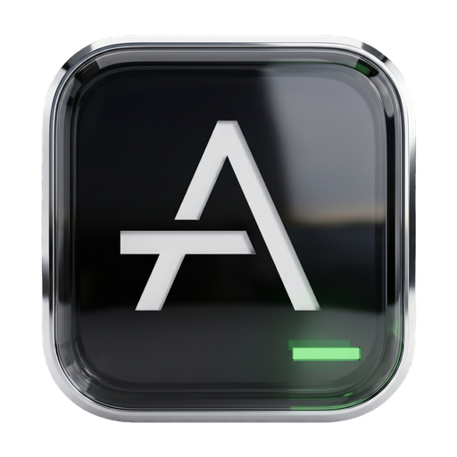

  

  # Agent Terminal

  **A terminal workspace built around AI coding agents.**

  
  
  

  

---

## Status

> 🧪 **Pre-alpha.** Heavily tested on **macOS + Zsh** — that's the daily-driver setup. Other shells and platforms may work but aren't part of the test matrix yet. Things will change without warning.

## Why this exists

If you live in a terminal alongside [Claude Code](https://claude.ai/code), [Codex](https://github.com/openai/codex), or other AI coding agents, you've probably noticed normal terminals weren't designed for the way you work now: **multiple agents, multiple projects, multiple long-lived sessions, all needing context at a glance**.

Agent Terminal is a terminal that knows the difference between a shell and an agent. It groups your tabs by project, recognises when an agent is running, and surfaces what's happening — the model in use, what's listening on which port, the git branch, your cwd — without you switching windows or running `ps`.

---

## Download

1. Grab the latest `.dmg` (universal binary — Apple Silicon + Intel) from the [releases page](https://github.com/DaniAkash/agent-terminal/releases).
2. Open it, drag **Agent Terminal** to your Applications folder.
3. First launch: right-click → Open (the app isn't notarised yet, so macOS Gatekeeper will warn — pre-alpha).

That's it. No config files, no daemons, no tmux setup.

---

## What you actually get

### Projects and tabs that survive
Group tabs under projects (`my-app`, `notes`, `infra`). Switch projects without losing your place — every tab remembers its working directory and reopens there.

### Live status bar
Always-on context for the focused tab — refreshed every couple of seconds, never gets stale:

- Process name, PID, elapsed time, memory
- Listening TCP ports (so you know when your dev server is up)
- Git branch, dirty indicator, ahead/behind remote
- Working directory (hover for full path)

### Theme-aware workspace
 Switch between light, dark, and system themes from the status bar. The chosen theme now applies across the whole application and the active terminal, so agent sessions stay readable in both light and dark modes.

### Supported agents

| Agent | Status |
|---|---|
| [Claude Code](https://claude.ai/code) | ✅ Supported |
| [Codex CLI](https://github.com/openai/codex) | ✅ Supported |
| [Gemini CLI](https://github.com/google-gemini/gemini-cli) | 🔜 Planned |
| [Cursor](https://www.cursor.com) | 🔜 Planned |
| [Open Code](https://github.com/sst/opencode) | 🔜 Planned |

Want support for another agent? [Open an issue](https://github.com/DaniAkash/agent-terminal/issues/new) or [tell me on X](https://x.com/dani_akash_).

### Find your way back
`Cmd+P` opens a switcher for your recently used tabs — type a few letters, hit Enter, you're there.

### Keyboard shortcuts
- `Ctrl+T` — new tab in the active project
- `Ctrl+W` — close the active tab
- `Ctrl+Tab` / `Ctrl+Shift+Tab` — cycle tabs
- `Ctrl+1` … `Ctrl+9` — jump to project N
- `Cmd+P` — open the recent-tabs quick-switcher

---

## Tested on

| Platform | Status |
|---|---|
| macOS 13+ (Apple Silicon / Intel) | ✅ Daily driver |
| Zsh | ✅ Daily driver |
| Bash | ⚠️ Should work, lightly tested |
| Linux | 🚧 Untested — contributors wanted |
| Windows | 🚧 Untested — contributors wanted |

## 🙏 Looking for contributors

The most useful thing you can do right now is **help bring Agent Terminal to Windows and Linux**. The Tauri + portable-pty stack underneath supports both, but I don't run those platforms day-to-day, so the integration work isn't happening on its own.

Specifically helpful:

- **Linux testers** — try a dev build, file what's broken (rendering, shell integration, keyboard shortcuts, anything).
- **Windows testers + developers** — Windows needs ConPTY-side adjustments and a separate shell-integration path; if you're up for Tauri/Rust work, this is the highest-leverage area to contribute.
- **Other agent integrations** — adding Gemini CLI, Cursor, Open Code, etc. is a focused PR (see [CONTRIBUTING.md](./CONTRIBUTING.md) for the MOD system guide).
- **Bug reports + feature ideas** — open an issue, even rough ones.

If you're interested, [open an issue](https://github.com/DaniAkash/agent-terminal/issues/new) or [reach out on X](https://x.com/dani_akash_) — happy to pair / sync on direction.

---

## Roadmap

Already shipped:
- ✅ Project-scoped workspaces with persistent tabs
- ✅ Live status bar (process, git, cwd, ports, model)
- ✅ Claude Code + Codex detection and agent badges
- ✅ Agent turn detection (idle / in-progress / awaiting / done)
- ✅ Keyboard shortcuts
- ✅ Universal macOS binary (Apple Silicon + Intel)
- ✅ Theme toggle with light / dark / system support

Coming next:
- 🚧 More agent integrations (Gemini CLI, Cursor, Open Code)
- 🚧 Linux support
- 🚧 Windows support
- 🚧 macOS App Store distribution

---

## Contributing

For development setup, project structure, code conventions, and the MOD-system guide for adding new agents:

→ **[CONTRIBUTING.md](./CONTRIBUTING.md)**

---

## License

MIT — see [LICENSE](./LICENSE).

Copyright © 2026 [Dani Akash](https://github.com/DaniAkash). If you build on this project, please retain the copyright notice as required by the MIT License.
